# Inventory ROP & EOQ Implementation Guide

## Overview

This document explains the **Reorder Point (ROP)** and **Economic Order Quantity (EOQ)** implementation in the Inventory Management System. The system automatically monitors stock levels and generates restocking requests when inventory falls below calculated thresholds.

---

## Core Formulas

### 1. Reorder Point (ROP)

**Formula:**
```
ROP = (Average Daily Demand × Lead Time in Days) + Safety Stock
```

**Purpose:** Determines the inventory level at which a new order should be placed to avoid stockouts.

**Components:**
- **Average Daily Demand**: Units sold per day (estimated from sales history or default value)
- **Lead Time**: Number of days from order placement to delivery
- **Safety Stock**: Buffer inventory to handle demand variability and supply delays

**Example:**
```
Average Daily Demand = 10 units/day
Lead Time = 7 days
Safety Stock = 20 units

ROP = (10 × 7) + 20 = 90 units
```

When current stock ≤ 90 units, the system triggers a restock request.

---

### 2. Economic Order Quantity (EOQ)

**Formula:**
```
EOQ = √((2 × Annual Demand × Ordering Cost) / Annual Holding Cost)
```

**Purpose:** Calculates the optimal order quantity that minimizes total inventory costs (ordering + holding costs).

**Components:**
- **Annual Demand**: Total units expected to be sold per year
- **Ordering Cost**: Fixed cost to place one order (admin + logistics)
- **Annual Holding Cost**: Cost to store one unit for one year

**Example:**
```
Annual Demand = 3,650 units (10 units/day × 365 days)
Ordering Cost = ₱500 per order
Unit Cost = ₱100
Holding Cost Rate = 25% of unit cost = ₱25/year

EOQ = √((2 × 3,650 × 500) / 25)
EOQ = √(3,650,000 / 25)
EOQ = √146,000
EOQ ≈ 382 units
```

This means the optimal order size is ~382 units per order.

---

### 3. Safety Stock Calculation (Advanced)

**Formula (Standard Deviation Method):**
```
Safety Stock = Z × σ × √L

Where:
- Z = Service level factor (e.g., 1.65 for 95% service level)
- σ = Standard deviation of daily demand
- L = Lead time in days
```

**Service Level Z-Scores:**
- 90% service level: Z = 1.28
- 95% service level: Z = 1.65
- 99% service level: Z = 2.33

**Example:**
```
Demand Std Deviation = 3 units/day
Lead Time = 7 days
Service Level = 95% (Z = 1.65)

Safety Stock = 1.65 × 3 × √7
Safety Stock = 1.65 × 3 × 2.646
Safety Stock ≈ 13 units
```

---

## Holding Cost Calculation Methods

The system supports **three methods** for calculating holding costs:

### Method 1: PERCENTAGE (Default - Recommended)

**Formula:**
```
Daily Holding Cost = (Unit Cost × Holding Rate) / 365
Annual Holding Cost = Unit Cost × Holding Rate
```

**Configuration:**
```javascript
HOLDING_COST_RATE: 0.25  // 25% annual holding cost
```

**Industry Standards for Construction Materials:**
- General Retail: 20-25%
- Construction Materials: 20-30%
- Perishable Goods: 30-40%
- Non-perishable Bulk: 15-20%

**Example:**
```
Unit Cost = ₱100
Holding Rate = 25%

Annual Holding Cost = ₱100 × 0.25 = ₱25/unit/year
Daily Holding Cost = ₱25 / 365 = ₱0.068/unit/day
```

**Advantages:**
- Industry-standard approach
- Reflects true cost of capital
- Easy to configure and understand
- Scales with product value

---

### Method 2: DAILY_RATE

**Formula:**
```
Daily Holding Cost = Fixed Rate (regardless of unit cost)
```

**Use Case:** Warehouse with fixed per-unit storage fees.

**Example:**
```
Daily Rate = ₱0.50/unit/day (fixed storage fee)

Annual Holding Cost = ₱0.50 × 365 = ₱182.50/unit/year
```

---

### Method 3: TIME_BASED

**Formula:**
```
Daily Holding Cost = Unit Cost / Days in Inventory
```

**Use Case:** New products with limited historical data.

**Example:**
```
Unit Cost = ₱100
Product Age = 30 days

Daily Holding Cost = ₱100 / 30 = ₱3.33/unit/day
```

**Note:** This method penalizes newer products (higher holding cost), incentivizing faster restocking calculations.

---

## Holding Cost Configuration Options

### Option A: System-Wide Configuration (Current Implementation)

**Location:** `src/features/pos/utils/inventoryCalculations.js`

```javascript
export const INVENTORY_CONFIG = {
  HOLDING_COST_RATE: 0.25,  // 25% annual holding cost
  HOLDING_COST_METHOD: 'PERCENTAGE'
};
```

**Advantages:**
- Simple, consistent across all products
- Easy to maintain
- Industry-standard approach

**Disadvantages:**
- No product-specific customization

---

### Option B: Category-Specific Holding Costs (Recommended Enhancement)

**Implementation Example:**

```javascript
const CATEGORY_HOLDING_RATES = {
  'Cement': 0.20,           // 20% - stable, non-perishable
  'Paint': 0.30,            // 30% - has shelf life
  'Electrical': 0.25,       // 25% - standard
  'Plumbing': 0.22,         // 22% - durable goods
  'Tools': 0.20,            // 20% - low depreciation
  'Hardware': 0.25,         // 25% - standard
  'default': 0.25           // 25% - fallback
};

export const getCategoryHoldingRate = (category) => {
  return CATEGORY_HOLDING_RATES[category] || CATEGORY_HOLDING_RATES['default'];
};
```

**Usage:**
```javascript
const holdingRate = getCategoryHoldingRate(product.category);
const holdingCost = calculateHoldingCost(unitCost, 'PERCENTAGE', 365, holdingRate);
```

---

### Option C: User-Defined in Admin Settings (Future Enhancement)

**Database Structure:**
```javascript
// Firestore Collection: SystemSettings/InventoryConfig
{
  holdingCostMethod: 'PERCENTAGE',
  defaultHoldingRate: 0.25,
  categoryRates: {
    'Cement': 0.20,
    'Paint': 0.30,
    // ...
  },
  defaultOrderingCost: 500,
  defaultLeadTime: 7,
  lowStockMultiplier: 1.5,
  minimumEOQ: 10
}
```

**Admin UI Features:**
- Configure holding cost rates per category
- Set ordering costs per supplier
- Adjust service levels (safety stock)
- Override EOQ minimums

---

## Logic Flow in POS System

### Workflow: Sale → Stock Check → Restock Request

```mermaid
graph TD
    A[Customer Purchase] --> B[Deduct Inventory]
    B --> C[Check Current Qty vs ROP]
    C -->|Current Qty > ROP| D[No Action]
    C -->|Current Qty ≤ ROP| E[Calculate Metrics]
    E --> F[Determine Priority]
    F -->|Qty = 0| G[Priority: CRITICAL]
    F -->|Qty < 50% of ROP| H[Priority: URGENT]
    F -->|Qty ≤ ROP| I[Priority: HIGH]
    F -->|Qty ≤ 150% of ROP| J[Priority: MEDIUM]
    G --> K[Create Restock Request]
    H --> K
    I --> K
    J --> K
    K --> L[Generate Notification]
    L --> M[Save to RestockingRequests Collection]
    M --> N[Alert Inventory Manager]
```



---

### Code Execution Flow

**Step 1: Sale Completion**
```javascript
// In handlePrintAndSave()
await updateInventoryQuantities(productsForDeduction, currentUser);
```

**Step 2: Inventory Deduction**
```javascript
// After deducting stock, check if restocking is needed
const restockCheck = checkRestockingThreshold(productData, variantIndex);

if (restockCheck.needsRestock) {
  await generateRestockingRequest(productData, variantIndex, locationInfo, currentUser);
}
```

**Step 3: ROP/EOQ Calculation**
```javascript
// checkRestockingThreshold() uses the utility
const metrics = calculateInventoryMetrics({
  currentQty,
  unitCost,
  leadTimeDays,
  safetyStock,
  maximumStockLevel,
  salesHistory,
  existingROP,
  existingEOQ,
  holdingPeriodDays
});

// Returns:
// - needsRestock: true/false
// - restockLevel (ROP)
// - eoq
// - suggestedOrderQuantity
// - priority: 'critical', 'urgent', 'high', 'medium', 'normal'
```

**Step 4: Create Restock Request**
```javascript
const restockingRequest = {
  requestId: 'RSR-xxxxx',
  productId,
  currentQuantity,
  restockLevel,  // ROP
  eoq,
  suggestedOrderQuantity,  // Based on EOQ and deficit
  priority,
  averageDailyDemand,
  leadTimeDays,
  statusMessage
};

await addDoc(collection(db, 'RestockingRequests'), restockingRequest);
```

**Step 5: Notify Inventory Manager**
```javascript
await generateRestockingNotification(restockingRequest, currentUser);
// Saves to Notifications collection
// targetRoles: ['InventoryManager', 'Admin']
```

---

## Priority Levels

| Priority  | Condition                       | Icon | Action Required                |
|-----------|---------------------------------|------|--------------------------------|
| CRITICAL  | Current Qty = 0                 | ⛔   | Immediate order                |
| URGENT    | Current Qty < 50% of ROP        | 🚨   | Order within 24 hours          |
| HIGH      | Current Qty ≤ ROP               | ⚠️   | Order within 3 days            |
| MEDIUM    | Current Qty ≤ 150% of ROP       | 📊   | Monitor and plan order         |
| NORMAL    | Current Qty > 150% of ROP       | ✅   | Stock OK                       |

---

## Suggested Order Quantity Logic

```javascript
if (needsRestock) {
  // Calculate target stock level
  const targetStockLevel = Math.min(maximumStockLevel, rop + eoq);
  
  // Calculate deficit
  const deficit = targetStockLevel - currentQty;
  
  // Suggest order quantity (at least EOQ or deficit, whichever is larger)
  suggestedOrderQuantity = Math.max(eoq, deficit);
}
```

**Example:**
```
Current Qty = 30
ROP = 90
EOQ = 382
Max Stock = 500

Target Stock = min(500, 90 + 382) = 472
Deficit = 472 - 30 = 442

Suggested Order = max(382, 442) = 442 units
```

---

## Code Structure

### File Organization

```
src/features/pos/
├── utils/
│   └── inventoryCalculations.js   # Core ROP/EOQ logic (NEW)
│
├── pages/
│   └── Pos_NewSale.jsx             # POS system (REFACTORED)
│
└── components/
    └── (POS UI components)
```

### Key Functions in `inventoryCalculations.js`

| Function | Purpose | Inputs | Outputs |
|----------|---------|--------|---------|
| `calculateROP()` | Calculate Reorder Point | avgDailyDemand, leadTime, safetyStock | ROP value |
| `calculateEOQ()` | Calculate Economic Order Quantity | annualDemand, orderingCost, holdingCost | EOQ value |
| `calculateHoldingCost()` | Calculate holding cost | unitCost, method, holdingPeriod, rate | Holding cost/day |
| `calculateInventoryMetrics()` | Complete metrics calculation | Product data object | Full metrics object |
| `estimateDemand()` | Estimate demand from sales | salesHistory, periodDays | Demand statistics |
| `batchCalculateInventoryMetrics()` | Process multiple products | Array of products | Products with metrics |

---

## Configuration Recommendations

### For Your Construction Materials Business

```javascript
// Recommended Configuration
export const INVENTORY_CONFIG = {
  // Use percentage method (industry standard)
  HOLDING_COST_METHOD: 'PERCENTAGE',
  HOLDING_COST_RATE: 0.25,  // 25% annual
  
  // Ordering cost (adjust based on your supplier terms)
  ORDERING_COST: 500,  // ₱500 per order
  
  // Default demand (will be overridden by sales data)
  DEFAULT_DAILY_DEMAND: 10,
  
  // Supplier lead times (days)
  DEFAULT_LEAD_TIME: 7,
  
  // Stock level thresholds
  LOW_STOCK_MULTIPLIER: 1.5,  // Alert at 150% of ROP
  MINIMUM_EOQ: 10,  // Don't order less than 10 units
  
  // Service level for safety stock
  SERVICE_LEVEL: 0.95  // 95% service level
};
```

### Category-Specific Rates (If Implementing)

```javascript
const CATEGORY_HOLDING_RATES = {
  // Fast-moving, stable products
  'Cement': 0.20,
  'Gravel': 0.18,
  'Sand': 0.18,
  
  // Products with shelf life concerns
  'Paint': 0.30,
  'Sealants': 0.28,
  'Adhesives': 0.28,
  
  // Standard hardware
  'Electrical': 0.25,
  'Plumbing': 0.22,
  'Tools': 0.20,
  'Hardware': 0.25,
  
  // High-value items (higher capital cost)
  'Power Tools': 0.30,
  'Machinery': 0.35,
  
  // Default fallback
  'default': 0.25
};
```

---

## Testing the Implementation

### Test Scenario 1: Product Falls Below ROP

**Setup:**
```
Product: Cement (25kg bag)
Current Qty: 95 units
ROP: 90 units
EOQ: 382 units
```

**Action:** Sell 10 bags (Qty drops to 85)

**Expected Result:**
- ✅ `needsRestock = true`
- ✅ Priority: HIGH
- ✅ Restock request created
- ✅ Notification sent to Inventory Manager
- ✅ Suggested Order Qty: 382 units (EOQ)

---

### Test Scenario 2: Product Out of Stock

**Setup:**
```
Product: PVC Pipe (3" diameter)
Current Qty: 2 units
ROP: 50 units
EOQ: 150 units
```

**Action:** Sell 2 pipes (Qty drops to 0)

**Expected Result:**
- ✅ `needsRestock = true`
- ✅ `isOutOfStock = true`
- ✅ Priority: CRITICAL
- ✅ Status Message: "⛔ OUT OF STOCK - Immediate restocking required!"
- ✅ Suggested Order Qty: 200 units (ROP + EOQ)

---

### Test Scenario 3: Stock OK (Above ROP)

**Setup:**
```
Product: Nails (1kg pack)
Current Qty: 200 units
ROP: 80 units
```

**Action:** Sell 5 packs (Qty drops to 195)

**Expected Result:**
- ✅ `needsRestock = false`
- ✅ No restock request created
- ✅ Status Message: "✅ STOCK OK"

---

## Future Enhancements

### 1. Historical Demand Analysis
- Track actual sales data per product
- Calculate moving averages (7-day, 30-day, 90-day)
- Detect seasonal trends
- Adjust demand forecasts automatically

### 2. Supplier-Specific Settings
```javascript
{
  supplierId: 'SUP001',
  leadTime: 5,
  orderingCost: 300,
  minimumOrderQty: 100,
  discountTiers: [
    { qty: 500, discount: 0.05 },
    { qty: 1000, discount: 0.10 }
  ]
}
```

### 3. Multi-Location Optimization
- Aggregate demand across all locations
- Calculate optimal allocation per location
- Consider transfer costs between locations

### 4. Advanced Analytics Dashboard
- Top products approaching ROP
- Total restocking cost projections
- Inventory turnover ratios
- Carrying cost analysis

---

## Troubleshooting

### Issue: EOQ Too Small

**Symptom:** EOQ calculates to very low values (e.g., 5 units)

**Cause:** 
- High holding cost relative to ordering cost
- Low demand

**Solution:**
```javascript
// Enforce minimum EOQ
const eoq = Math.max(Math.ceil(calculatedEOQ), MINIMUM_EOQ);
```

---

### Issue: ROP Too High

**Symptom:** Restock alerts trigger too early

**Cause:**
- Overestimated demand
- Excessive safety stock

**Solution:**
- Review demand estimation
- Adjust `DEFAULT_DAILY_DEMAND`
- Reduce safety stock if supply is reliable

---

### Issue: Frequent Restocking

**Symptom:** Same product generates multiple restock requests

**Cause:**
- EOQ too small
- Sales velocity very high

**Solution:**
- Increase EOQ by adjusting ordering cost down or holding cost down
- Review and increase `ORDERING_COST` to incentivize larger orders

---

## Summary

| Concept | Formula | Purpose | Configured Value |
|---------|---------|---------|------------------|
| **ROP** | (Avg Demand × Lead Time) + Safety Stock | When to reorder | Calculated per product |
| **EOQ** | √((2 × D × S) / H) | How much to order | Calculated per product |
| **Holding Cost** | Unit Cost × Rate / 365 | Storage cost per unit per day | 25% annual (configurable) |
| **Ordering Cost** | Fixed per order | Cost to place order | ₱500 (configurable) |
| **Safety Stock** | Z × σ × √L | Buffer inventory | Based on service level |

---

## Key Takeaways

1. **ROP** ensures you never run out of stock before new inventory arrives.
2. **EOQ** minimizes total inventory costs by balancing ordering and holding costs.
3. **Holding Cost** should be configured as a **percentage of unit cost** (industry standard: 20-30%).
4. **Ordering Cost** can be configured per supplier or system-wide.
5. **Priority Levels** help inventory managers focus on critical stockouts first.
6. **Sales History** improves demand forecasting over time (fallback to defaults when unavailable).

---

## References

- Operations Management Textbook: Chase, Jacobs, Aquilano
- Inventory Optimization Best Practices
- Construction Materials Industry Standards

---

**Last Updated:** 2025-01-01  
**Version:** 1.0  
**Author:** GitHub Copilot
